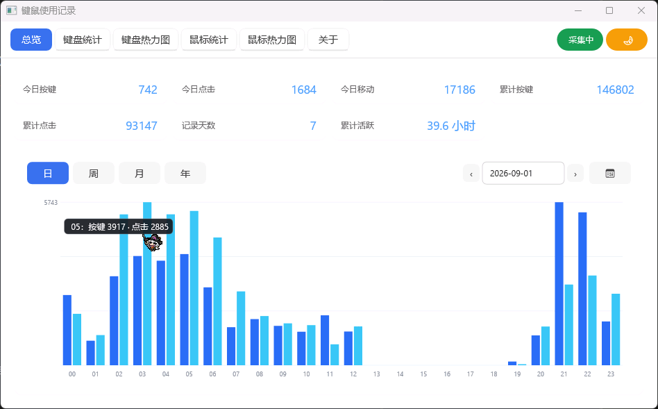

# 键鼠使用记录 (KeyMouseTracker)

一个本地运行、零外部依赖的 Windows 键盘 / 鼠标使用记录工具。通过全局低层钩子统计按键、点击、移动次数，并以可视化界面（键盘热力图、鼠标热力图、历史趋势）呈现。所有数据仅保存在本机，不联网、不上传。

> 需要**管理员权限**运行（用于在拥有更高权限的应用（如部分游戏）中也能捕获按键与鼠标操作）。双击 exe 时会自动弹出 UAC 授权。

## 功能特性

- **全局统计**：按键、鼠标点击（左 / 中 / 右）、鼠标移动次数，按日聚合并附带小时级分布。

- **键盘热力图**：108 / 87 / 61 三种配列切换；支持隐藏 / 恢复单键热度（点击或按住左键拖动批量反转显示）。

- **鼠标热力图**：基于虚拟屏幕坐标的网格热力分布。

- **历史趋势**：按日 / 周 / 月 / 年查看按键与点击趋势，悬停显示数值。

- **系统托盘**：后台驻留，托盘菜单可显示 / 暂停 / 退出等。

- **开机自启动**：可选开机自动运行（HKCU `Run` 项）。

- **主题切换**：浅色 / 深色主题。

- **数据管理**：一键导出备份、导入覆盖、清空全部记录。



## 隐私说明

- 仅统计**次数**，不记录按键内容（字符、输入序列）；

- 数据保存于 `%APPDATA%\KeyMouseTracker\data.bin`（自定义 `KMT4` 二进制格式）；

- 完全本地运行，无任何网络请求。

## 系统要求

- Windows 10 / Windows 11（x64）

- 管理员权限

## 构建

### 环境依赖

- [Visual Studio](https://visualstudio.microsoft.com/)（含 **MSVC x64 工具链**、**CMake** 与 **Ninja**，均在 VS 安装时可选组件中包含）

- PowerShell

- Windows SDK 10.0.22621 及以上

### 编译

在项目根目录运行：

```powershell
.\build.ps1
```

生成产物为 `KeyMouseTracker.exe`（约 2.6 MB，静态链接 CRT、无第三方运行时依赖，单文件分发）。

如需彻底清理后重建：

```powershell
.\clean.ps1
.\build.ps1
```

> 注意：`build.ps1` 中硬编码了本机 VS 路径 `G:\Program Files\Microsoft Visual Studio\18\Community`，如你的 VS 安装位置不同，请修改脚本开头的 `$VsPath`。

## 项目结构

```
├─ src/
│  ├─ main.cpp         # 主程序：UI、事件、热力图与趋势图渲染
│  ├─ app.uix          # 界面布局与样式（core-ui 的 .uix 标记语言）
│  ├─ data.cpp/.h      # 数据模型、持久化（KMT4 格式与日期算法）
│  ├─ hooks.cpp/.h     # 全局键盘 / 鼠标低层钩子
│  └─ autostart.cpp/.h # 开机自启动（注册表 Run 项）
├─ vendor/core-ui      # 第三方 UI 框架（静态链接依赖，随仓库分发）
├─ image/README/       # 界面演示 GIF
├─ app.manifest        # 应用清单（Common Controls v6、PerMonitorV2 DPI、UAC 管理员权限）
├─ build.ps1           # 一键构建脚本
├─ clean.ps1           # 清理构建产物
├─ LICENSE
└─ .gitignore
```

## 技术栈

- 语言：C++17（MSVC）

- UI：core-ui（Direct2D / Direct3D，内嵌 QuickJS-NG 与 lunasvg）

- 构建：CMake + Ninja，`/MT` 静态 CRT

- 数据：本地二进制文件，霍华德·辛南特日期算法

## License

本项目基于 [MIT License](LICENSE)。

- 作者：Taumata

- 项目地址：<https://github.com/Taumata-wwq/KeyMouseTracker>

> 说明：core-ui、QuickJS-NG、lunasvg 等引用的第三方库遵循各自的开源协议（详见 About 页引用链接）。

