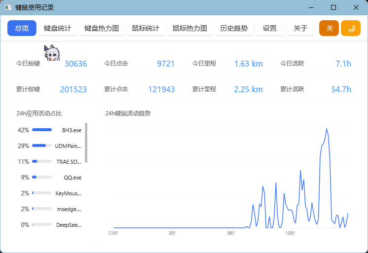

# 键鼠使用记录 (KeyMouseTracker)

一个本地运行、零外部依赖的 Windows 键盘 / 鼠标使用记录工具。通过全局低层钩子统计按键、点击、移动次数，并以可视化界面（键盘热力图、鼠标热力图、历史趋势、24 小时 APM 曲线）呈现。所有数据仅保存在本机，不联网、不上传。

> 需要**管理员权限**运行（用于在拥有更高权限的应用（如部分游戏）中也能捕获按键与鼠标操作）。双击 exe 时会自动弹出 UAC 授权。

## 功能特性

- **全局统计**：按键、鼠标点击（左 / 中 / 右）、移动采样次数，按日聚合并附带小时级分布；区分左右 Shift / Ctrl / Alt 修饰键，按键具备防重复逻辑。
- **会话与活跃分析**：自动划分活跃段（空闲阈值默认 5 分钟，超过即计为空闲），统计今日活跃 / 空闲时长、最长连续活跃段、活跃段次数。
- **24 小时 APM 曲线**：以 10 分钟为粒度的按键 + 点击操作强度曲线，悬停查看任一时段的峰值与活动分布。
- **键盘热力图**：108 / 87 / 61 三种配列切换；支持隐藏 / 恢复单键热度（点击或按住左键拖动批量切换显示）。
- **鼠标热力图**：基于虚拟屏幕坐标的 48×27 网格热力分布，悬停显示该格点击次数。
- **鼠标移动里程**：像素位移按系统 DPI 折算为厘米（今日 / 累计展示）。
- **历史趋势**：按日 / 月 / 年查看柱状趋势，另有**本周时段** 7×24 热力图（周一至周日 × 24 小时，168 格），悬停显示数值。
- **前台应用统计（可选）**：记录每个应用（exe 名）产生的按键 + 点击次数，支持排除列表（逗号分隔 exe 名，可逐个移除）。默认关闭，开启后仅记录应用名与次数。
- **系统托盘**：后台驻留，托盘菜单可显示 / 暂停 / 退出等。
- **开机自启动**：可选开机自动运行，通过**计划任务**（登录触发器 + 最高权限）实现，登录时不受 UAC 拦截。
- **主题切换**：浅色 / 深色主题。
- **数据管理**：备份 `.kmt`、导出 CSV / JSON（均可选择日期范围，CSV 为六段表：每日汇总、按键×小时矩阵、按键分布、鼠标热力、前台应用、分钟级活跃）、导入覆盖、按范围清除记录。
- **紧凑模式**：窗口宽度不足 640px 时自动切换紧凑排版。
- **存储概况**：设置页显示数据文件占用、记录天数与日期范围。



## 隐私说明

- 仅统计**次数**，不记录按键内容（字符、输入序列）；
- 数据保存于 `%APPDATA%\KeyMouseTracker\data.bin`（自定义 `KMT5 v10` 二进制格式，varint 压缩，兼容旧 `KMT4`，历次版本自动升级）；
- 前台应用统计默认关闭；开启后也只记录 exe 名与次数，不采集窗口标题、输入内容，并可通过排除列表屏蔽指定应用；
- 完全本地运行，无任何网络请求。

## 系统要求

- Windows 10 / Windows 11（x64）
- 管理员权限

## 构建

### 环境依赖

- [Visual Studio](https://visualstudio.microsoft.com/)（含 **MSVC x64 工具链**、**CMake** 与 **Ninja**，均在 VS 安装时可选组件中包含）
- PowerShell
- Windows SDK 10.0.22621 及以上

### 编译

在项目根目录运行：

```powershell
.\build.ps1
```

生成产物为 `KeyMouseTracker.exe`（约 2.7 MB，静态链接 CRT、无第三方运行时依赖，单文件分发）。

如需彻底清理后重建：

```powershell
.\clean.ps1
.\build.ps1
```

> 注意：`build.ps1` 中硬编码了本机 VS 路径 `G:\Program Files\Microsoft Visual Studio\18\Community`，如你的 VS 安装位置不同，请修改脚本开头的 `$VsPath`。

## 项目结构

```
├─ src/
│  ├─ main.cpp         # 主程序：UI、事件、热力图与趋势图渲染
│  ├─ app.uix          # 界面布局与样式（core-ui 的 .uix 标记语言）
│  ├─ data.cpp/.h      # 数据模型、持久化（KMT5 v10 格式与日期算法）
│  ├─ hooks.cpp/.h     # 全局键盘 / 鼠标低层钩子
│  ├─ export.cpp/.h    # CSV / JSON 导出（零依赖）
│  └─ autostart.cpp/.h # 开机自启动（计划任务，登录时最高权限运行）
├─ vendor/core-ui      # 第三方 UI 框架（静态链接依赖，随仓库分发）
├─ image/README/       # 界面演示 GIF
├─ app.manifest        # 应用清单（Common Controls v6、PerMonitorV2 DPI、UAC 管理员权限）
├─ app.rc              # 应用资源脚本（内嵌应用清单）
├─ build.ps1           # 一键构建脚本
├─ clean.ps1           # 清理构建产物
├─ LICENSE
└─ .gitignore
```

## 技术栈

- 语言：C++17（MSVC）
- UI：core-ui（Direct2D / Direct3D，内嵌 QuickJS-NG 与 lunasvg）
- 构建：CMake + Ninja，`/MT` 静态 CRT
- 数据：本地二进制文件，霍华德·辛南特日期算法

## License

本项目基于 [MIT License](LICENSE)。

- 作者：Taumata
- 项目地址：[https://github.com/Taumata-wwq/KeyMouseTracker](https://github.com/Taumata-wwq/KeyMouseTracker)

> 说明：core-ui、QuickJS-NG、lunasvg 等引用的第三方库遵循各自的开源协议（详见 About 页引用链接）。
