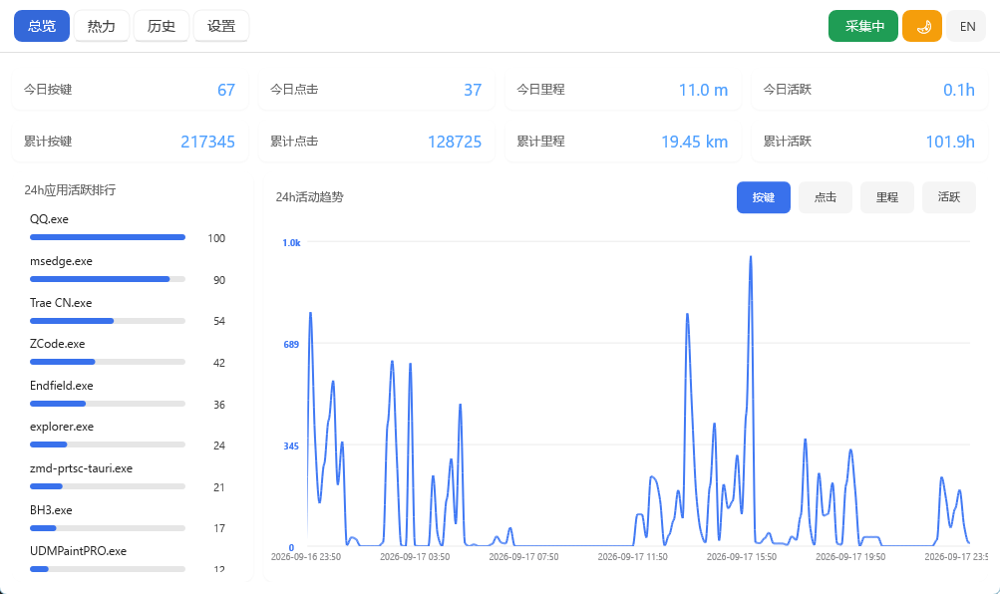
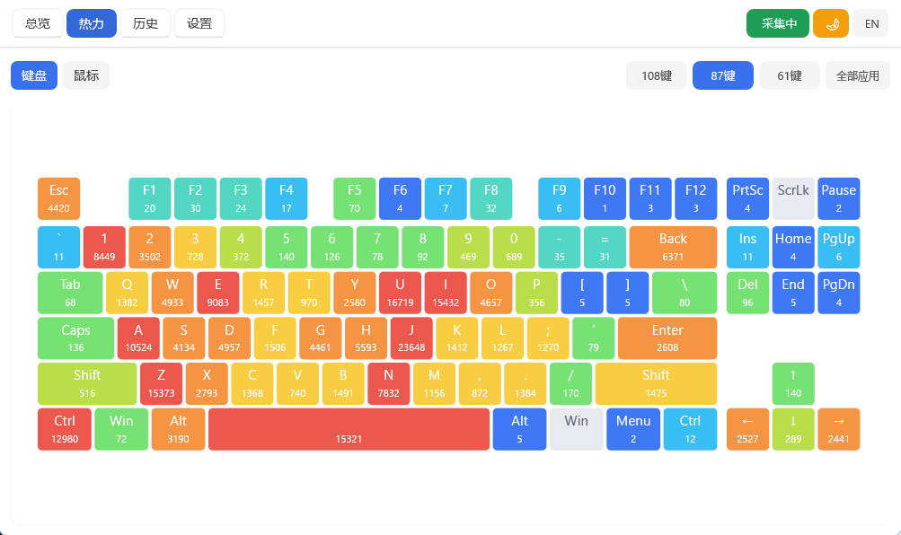
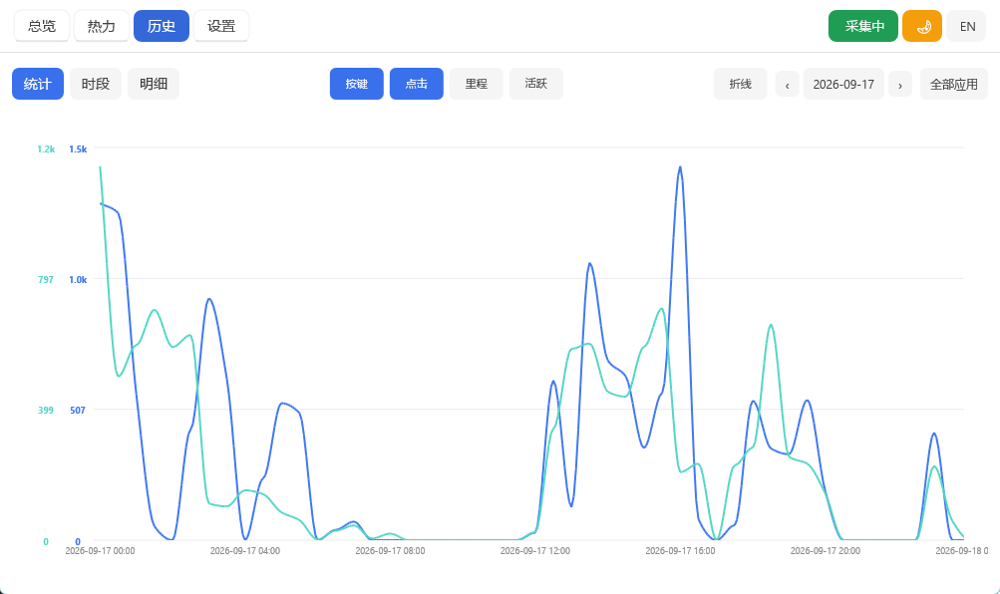
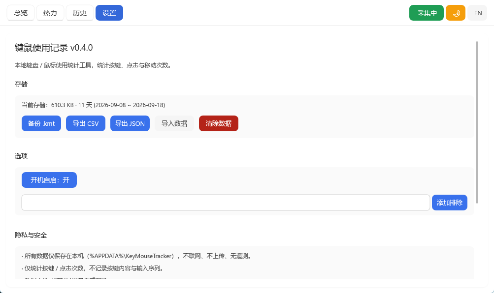

# 键鼠使用记录 (KeyMouseTracker)

一个本地运行、零外部依赖的 Windows 键盘 / 鼠标使用记录工具。通过全局低层钩子统计按键、点击、移动次数，并以可视化界面呈现（键盘热力图、鼠标热力图、历史趋势、24 小时活动曲线）。所有数据仅保存在本机，不联网、不上传。

> 需要**管理员权限**运行（用于在拥有更高权限的应用（如部分游戏）中也能捕获按键与鼠标操作）。

## 界面预览

**总览** —— 今日 / 累计 KPI、活跃时长、24h 应用排行与活动趋势



**热力图** —— 键盘 / 鼠标热力分布



**历史** —— 统计表 / 明细 / 时段矩阵



**设置** —— 数据管理、开机自启、排除列表、关于



## 功能特性

### 统计与采集

- **全局统计**：按键、鼠标点击（左 / 中 / 右）、移动采样次数，按日聚合并附带小时级分布；区分左右 Shift / Ctrl / Alt 修饰键，按键具备防重复逻辑。
- **会话与活跃分析**：自动划分活跃段（空闲阈值默认 5 分钟，可配置），统计今日活跃 / 空闲时长、最长连续活跃段、活跃段次数。
- **鼠标移动里程**：像素位移按系统 DPI 折算为厘米（今日 / 累计展示）。
- **前台应用统计（默认开启）**：以「应用 × 分钟」粒度记录每个应用（exe 名）的按键、点击与移动明细，支持排除列表。

### 可视化

- **键盘热力图**：108 / 87 / 61 三种配列切换；支持隐藏 / 恢复单键热度（点击或按住左键拖动批量切换显示）。
- **鼠标热力图**：基于虚拟屏幕坐标的 48×27 网格热力分布，悬停显示该格点击次数。
- **24 小时活动曲线**：以 10 分钟为粒度的按键 + 点击操作强度曲线，悬停查看任一时段的峰值与活动分布。
- **历史视图**：三模式——**统计表**（全时域可缩放时间序列图，日期选择跳转）、**明细**（按键排行 + 鼠标点击 / 里程 / 活跃汇总，支持自定义起止时间）、**时段矩阵**（日 24×60、周 7×24、月 N×24 热力格）。
- **可缩放时间序列图表**：滚轮缩放（光标锚点）、拖拽平移、十字光标、随精度变化的悬浮浮窗（分钟 → 月共 8 档），纵轴随可见区间联动重定标并平滑过渡。
- **多系列叠加**：趋势 / 总览图中可勾选叠加 按键 / 点击 / 里程 / 活跃 多条系列，量纲差异自动走左右双轴。
- **应用趋势预览**：总览「24h 应用活跃排行」中，悬停应用即可预览其 24h 趋势，点选可固定，右侧趋势图即时切换。
- **按应用筛选**：可在热力 / 历史视图中按单一应用筛选统计。

### 实用功能

- **系统托盘**：后台驻留，托盘菜单可显示 / 暂停 / 退出等。
- **开机自启动**：通过**计划任务**（登录触发器 + 最高权限）实现，登录时不受 UAC 拦截。
- **主题与语言**：浅色 / 深色主题；界面、托盘、弹窗、图表标签完整中英双语，可一键切换并持久化。
- **数据管理**：备份 `.kmt`、导出 CSV / JSON（可选日期范围）、导入覆盖、按范围清除记录。
- **紧凑模式**：窗口宽度不足 640px 时自动切换紧凑排版。
- **存储概况**：设置页显示数据文件占用、记录天数与日期范围。
- **数据迁移**：旧版本数据自动升级为「应用 × 分钟明细」格式，历史数据不丢失。

## 系统要求

- Windows 10 / Windows 11（x64）
- 管理员权限

## 隐私说明

- 仅统计**次数**，不记录按键内容（字符、输入序列）；
- 数据保存于 `%APPDATA%\KeyMouseTracker\data.bin`（自定义二进制格式，varint 压缩，自动兼容旧版本数据）；
- 前台应用统计默认开启，但只记录 exe 名与次数，不采集窗口标题、输入内容，并可通过排除列表屏蔽指定应用；
- 主数据文件采用「先写临时文件再原子替换」的方式落盘，写盘中断不损坏数据；
- 完全本地运行，无任何网络请求。

---

## 开发者

### 外部调用 API

本机提供一个 **命名管道** 只读 JSON 接口，外部软件可据此读取统计数据：

- 管道名：`\\.\pipe\KeyMouseTrackerApi`
- 支持命令：`ping` / `state` / `summary` / `today` / `apps` / `range YYYY-MM-DD YYYY-MM-DD`
- 协议、响应字段与 C++ / Python / PowerShell 示例详见 [docs/API.md](docs/API.md)。

仅监听本机命名管道，不监听任何网络端口、不联网，与隐私原则一致。

### 构建

环境依赖：[Visual Studio](https://visualstudio.microsoft.com/)（含 MSVC x64 工具链、CMake、Ninja）、PowerShell、Windows SDK 10.0.22621 及以上。

在项目根目录运行：

```powershell
.\build.ps1
```

产物为 `KeyMouseTracker.exe`（约 2.9 MB，静态链接 CRT、单文件分发）。彻底重建：`.\clean.ps1` 后再次 `.\build.ps1`。

> `build.ps1` 优先使用本机 VS 路径，缺失时通过 `vswhere` 自动定位 Visual Studio（含 CI 环境），一般无需手工修改。

### 测试与 CI

单元测试覆盖纯逻辑（日期算法 / varint 编解码 / JSON-CSV 转义 / 旧数据迁移分摊 / 时间格式化），采用 unity build 直接包含实现文件以测试其中的 static 函数：

```powershell
.\build_test.ps1
```

GitHub Actions（`.github/workflows/build.yml`）在推送 / PR 时自动构建 exe、运行测试并上传产物。

### 项目结构

```
├─ src/
│  ├─ main.cpp         # 主程序：UI、事件、热力图与趋势图渲染
│  ├─ app.uix          # 界面布局与样式（core-ui 的 .uix 标记语言，含 i18n 文案字典）
│  ├─ data.cpp/.h      # 数据模型、持久化与日期算法（原子写盘 + .bak 备份）
│  ├─ hooks.cpp/.h     # 全局键盘 / 鼠标低层钩子（回调脱敏入队）
│  ├─ export.cpp/.h    # CSV / JSON 导出（零依赖）
│  ├─ api.cpp/.h       # 本机命名管道 JSON API（外部软件读取统计）
│  ├─ tray.cpp/.h      # 系统托盘（图标 / 菜单 / 命令分派 / 还原主窗口）
│  ├─ stats_json.cpp/.h # 统计 JSON 构建（今日/累计/存储/应用排行等纯函数）
│  ├─ stats_query.cpp/.h # 应用筛选 + 明细范围查询上下文（聚合缓存/明细聚合）
│  ├─ heatmap.h        # 键盘配列布局 + 热力色阶/归一化（纯几何/颜色）
│  ├─ version.h        # 应用版本 / 数据格式版本单一来源
│  ├─ i18n.h           # 中英双语文案辅助（tr）
│  ├─ uiutil.h         # 无全局依赖的纯工具（JSON / 日期 / 系列标志解析）
│  └─ autostart.cpp/.h # 开机自启动（计划任务）
├─ docs/               # ROADMAP.md（路线图）· API.md（外部调用协议）
├─ vendor/core-ui      # 第三方 UI 框架（静态链接，随仓库分发）
├─ image/README/       # 界面截图
├─ app.manifest        # 应用清单（Common Controls v6、PerMonitorV2 DPI、UAC 管理员权限）
├─ app.rc              # 应用资源脚本（内嵌应用清单）
├─ build.ps1           # 一键构建脚本
├─ clean.ps1           # 清理构建产物
└─ LICENSE
```

### 技术栈

- 语言：C++17（MSVC）
- UI：core-ui（Direct2D / Direct3D，内嵌 QuickJS-NG 与 lunasvg）
- 构建：CMake + Ninja，`/MT` 静态 CRT
- 数据：本地二进制文件

## License

本项目基于 [MIT License](LICENSE)。

- 作者：Taumata
- 项目地址：[https://github.com/Taumata-wwq/KeyMouseTracker](https://github.com/Taumata-wwq/KeyMouseTracker)

> core-ui、QuickJS-NG、lunasvg 等第三方库遵循各自的开源协议（详见 About 页引用链接）。
